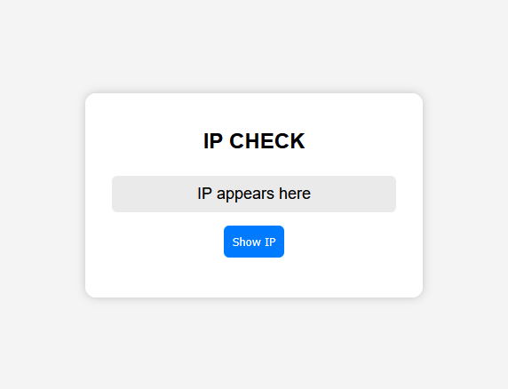
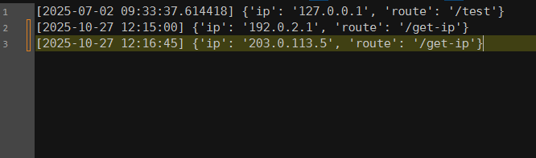

# Flask Logging Project


For German version of this README, see [README_DE.md](README_DE.md)

This project is a small website logging system I developed to gain practical experience with **Linux servers, Docker, and Python**. It consists of **two Docker containers**:

1. **Web container:** Hosts a simple website where visitors can check their IP address.  
2. **Logger container:** Records each request with a timestamp in a `.txt` file.

Development was done on a **virtual Ubuntu server** in VirtualBox and later tested on a **Debian server**, with all connections made via SSH from a WSL-Debian terminal on Windows. The project was intentionally carried out in the terminal to simulate realistic server administration.

> **Note:** The HTML and CSS files were entirely generated by ChatGPT.

## How to use

### Prerequisites
- Flask, Docker & Docker Compose installed

### Run with Docker Compose
```bash
docker-compose up --build
```

## Screenshots
**Website:**




**Sample Log:**

