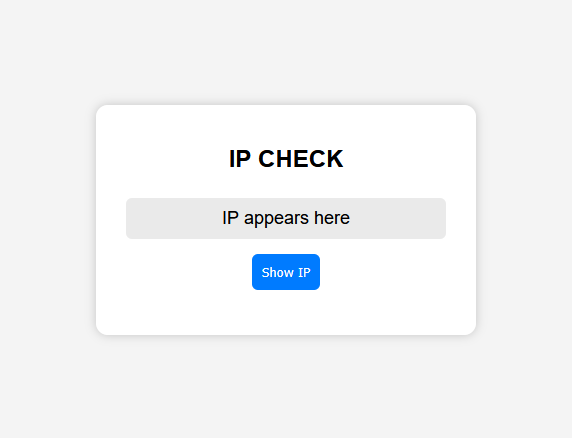
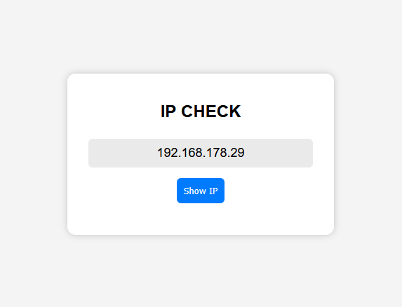
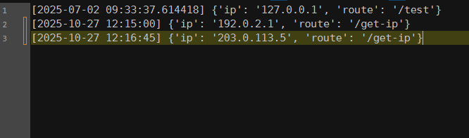

# Flask Logging Projekt


Dieses Projekt ist ein kleines Website-Logging-System, das ich entwickelt habe, um praktische Erfahrung mit **Linux-Servern, Docker und Python** zu sammeln. Es besteht aus **zwei Docker-Containern**:

1. **Web-Container:** Hostet eine einfache Website, auf der Besucher ihre IP-Adresse prüfen können.  
2. **Logger-Container:** Zeichnet jede Anfrage mit einem Zeitstempel in einer `.txt`-Datei auf.

Die Entwicklung erfolgte auf einem **virtuellen Ubuntu-Server** in VirtualBox und wurde später auf einem **Debian-Server** getestet. Alle Verbindungen erfolgten über SSH von einem WSL-Debian-Terminal unter Windows. Das Projekt wurde bewusst vollständig im Terminal durchgeführt, um realistische Serveradministration zu simulieren.

> **Hinweis:** Die HTML- und CSS-Dateien wurden vollständig von ChatGPT generiert.

## Verwendung

### Voraussetzungen
- Flask, Docker & Docker Compose installiert

### Mit Docker Compose starten
```bash
docker-compose up --build
```

## Screenshots
**Website:**





**Beispiel Log:**

